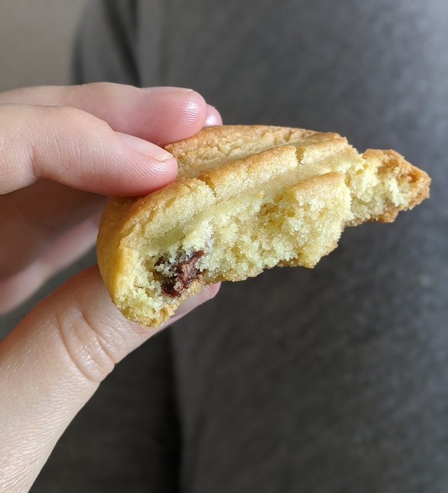

# Almond and chocolate chip biscuit

 * 2 cups self raising flour
 * 1 cup caster sugar
 * 185g butter
 * 1 egg
 * 1/2 tsp vanilla extract
 * 60g hazelnut or almond meal
 * 60g chocolate, grated or bits

Cream the butter and sugar in a mixer. 

Add the egg and vanilla and combine.

Incorporate flour and salt. 

Mix in nuts, chocolate, and coconut

Roll into small balls, and press fork into top to flatten and shape

Bake at 180°C for 15 minutes. Cookies will be golden, but still soft, and will harden on cooling
 

