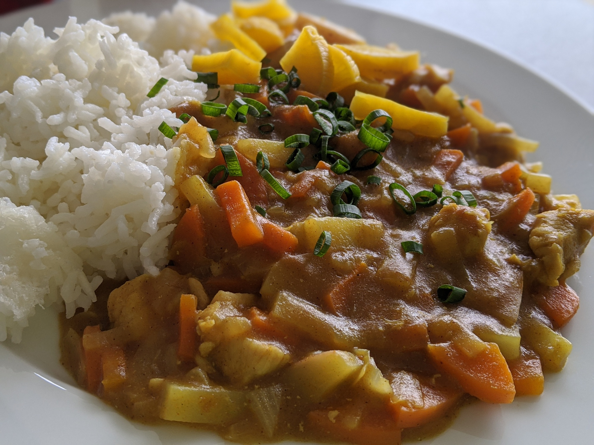

# Japanese Curry

Serves: 1

* 1 portion Golden Curry Mix (Mild, Med, or Hot)
* 80g potato, cubed
* 80g carrot, cubed
* 100g onion, sliced thinly
* 100g chicken breast, cubed
* Rice, to serve
* Spring onion, to garnish
* Japanese pickles, assorted (to garnish)

Follow packet directions. 

Or:

Saute onions and chicken until chicken is cooked through. 

Add potato and carrot, and 1 cup water. 

Boil until potato and carrot cooked through. 

Turn off heat. 

Add Curry Mix cube, gently stirring until incorporated. 

Turn heat back on low, and cook for a few minutes until gently simmering. 

Serve with rice and pickles, garnish with spring onion. 

