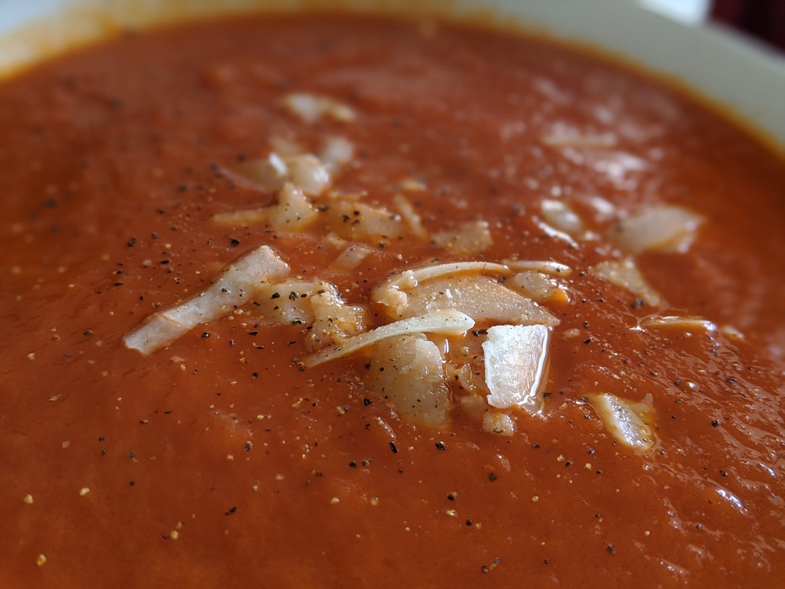

# 3-Ingredient Tomato Soup

[from e. hashman](https://twitter.com/ehashdn/status/1284350876992208896):

- 1 medium onion, large slices
- 1/4c butter
- 28oz can of peeled tomatoes

> Melt butter, sauté onions until translucent
> add tomatoes + 1.5c water
> simmer uncovered for 40m
> Purée with a stick blender
> Season with salt (0.5-1tsp)
> Yum!

Garnish shaved parmesan and cracked black pepper.

